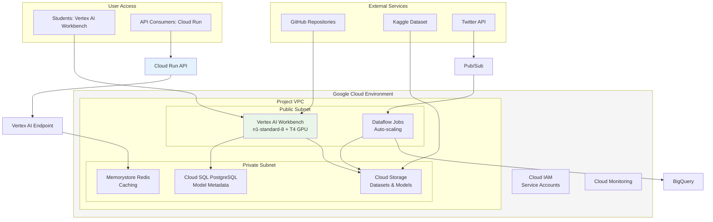

# Fake News Detection Project - Google Cloud Platform Version

## 📋 Project Overview

This is the complete Google Cloud Platform (GCP) version of the Fake News Detection capstone project. The project demonstrates GPU-accelerated machine learning using NVIDIA RAPIDS on Google Cloud Platform, featuring end-to-end ML pipeline development from data ingestion to model deployment.

### 🎯 Project Goals
- Build ML classifiers (SVM, Random Forest, Logistic Regression) using RAPIDS cuML
- Compare CPU (sklearn) vs GPU (cuML) performance on GCP
- Deploy scalable fake news detection API on Cloud Run
- Achieve >85% accuracy and >2x GPU speedup
- Complete project by November 28, 2025

## 🏗️ GCP Infrastructure Overview

### Core Resources
- **Project ID**: `fake-news-project`
- **Vertex AI Workbench**: Primary compute environment with GPU support (T4/A100)
- **Cloud Storage Bucket**: `gs://fake-news-project-data-2025` - Data storage and model artifacts
- **Cloud IAM**: 8 student service accounts with Vertex AI and Storage access
- **Region**: us-central1 - Optimized for low latency and compliance

### Infrastructure Architecture


### Team Structure
- **Group A**: John (PM), Elsa (Data Analyst), Bismarck (ML Engineer), Teddy (QA)
- **Group B**: Kigen (PM), Lamech (Data Analyst), Nehemiah (ML Engineer), Wilberforce (QA)

## 📁 Project Files Structure

### Core GCP Documentation
1. **`fake_news_detection_workflow_gcp.md`** - 10-page workflow guide with detailed GCP architecture
2. **`environment_setup_guide_gcp.md`** - GCP environment setup with Vertex AI, Cloud Storage, IAM
3. **`student_onboarding_guide_gcp.md`** - Student onboarding with GCP authentication
4. **`project_kickoff_guide_gcp.md`** - Project kickoff with GCP infrastructure details
5. **`team_management_guide_gcp.md`** - GCP-focused team management framework

### Technical Implementation
6. **`etl_pipeline_gcp.py`** - Data ingestion pipeline with Cloud Storage integration
7. **`verify_setup_gcp.py`** - Environment verification script for GCP
8. **`etl_usage_guide_gcp.md`** - Detailed ETL pipeline usage instructions

### Reference Files (AWS Version)
- Original AWS workflow, setup guides, and technical files for comparison

### Credentials & Communication
- **`student_credentials.txt`**: AWS IAM access keys (for reference)
- **`student_emails.md`**: Personalized student email templates

## 🚀 Quick Start Guide

### 1. GCP Project Setup
```bash
# Enable required APIs
gcloud services enable compute.googleapis.com
gcloud services enable storage.googleapis.com
gcloud services enable iam.googleapis.com
gcloud services enable aiplatform.googleapis.com
gcloud services enable dataflow.googleapis.com
gcloud services enable run.googleapis.com
```

### 2. Service Account Creation
```bash
# Create service accounts for each student
gcloud iam service-accounts create bismark-student \
    --description="ML Engineer Service Account"

gcloud iam service-accounts create elsa-student \
    --description="Data Analyst Service Account"

# Assign roles
gcloud projects add-iam-policy-binding fake-news-project \
    --member="serviceAccount:bismark-student@fake-news-project.iam.gserviceaccount.com" \
    --role="roles/aiplatform.user"

gcloud projects add-iam-policy-binding fake-news-project \
    --member="serviceAccount:bismark-student@fake-news-project.iam.gserviceaccount.com" \
    --role="roles/storage.admin"
```

### 3. Cloud Storage Setup
```bash
# Create bucket
gsutil mb -p fake-news-project -c standard -l us-central1 gs://fake-news-project-data-2025/

# Set permissions
gsutil iam ch serviceAccount:bismark-student@fake-news-project.iam.gserviceaccount.com:roles/storage.admin gs://fake-news-project-data-2025/
```

### 4. Vertex AI Workbench Setup
```bash
# Create Vertex AI Workbench instance
gcloud notebooks instances create fake-news-workbench \
    --vm-image-project=deeplearning-platform-release \
    --vm-image-family=tf-ent-2-8-cu113-notebooks \
    --machine-type=n1-standard-8 \
    --accelerator-type=NVIDIA_TESLA_T4 \
    --accelerator-count=1 \
    --location=us-central1-a
```

### 5. ETL Pipeline Execution
```bash
# Run data ingestion
python etl_pipeline_gcp.py

# Verify setup
python verify_setup_gcp.py
```

## 📊 Project Phases

### Phase 1: Planning & Setup (Nov 13-15)
- [ ] GCP environment setup and service account creation
- [ ] Vertex AI Workbench configuration
- [ ] Team formation and communication channels
- [ ] Initial ETL pipeline testing

### Phase 2: Data Processing (Nov 16-18)
- [ ] Kaggle dataset download via Cloud Storage
- [ ] Twitter API integration with Pub/Sub
- [ ] NewsAPI data collection via Cloud Functions
- [ ] Data preprocessing with Dataflow + RAPIDS

### Phase 3: Model Development (Nov 19-22)
- [ ] sklearn baseline model implementation
- [ ] cuML GPU acceleration comparison on Vertex AI
- [ ] Hyperparameter tuning and optimization
- [ ] Model performance benchmarking

### Phase 4: Deployment & Testing (Nov 23-25)
- [ ] FastAPI development in Vertex AI Workbench
- [ ] Cloud Run deployment with CI/CD
- [ ] Vertex AI Endpoint creation
- [ ] Load testing and performance validation

### Phase 5: Presentation (Nov 26-28)
- [ ] Final model optimization
- [ ] Live API demonstration
- [ ] Performance metrics presentation
- [ ] Project documentation completion

## 🛠️ Key Technologies

### RAPIDS Ecosystem
- **cuDF**: GPU DataFrames for data processing
- **cuML**: GPU-accelerated ML algorithms
- **cuGraph**: Graph analytics for network analysis

### Google Cloud Services
- **Vertex AI**: Unified ML platform (Workbench, Training, Endpoints)
- **Cloud Storage**: Scalable data storage and sharing
- **Dataflow**: Distributed data processing with RAPIDS
- **Cloud Run**: Serverless API deployment
- **Pub/Sub**: Real-time data streaming
- **BigQuery**: Analytics and data exploration

### Development Tools
- **Python 3.9+**: Primary programming language
- **Jupyter Lab**: Interactive development in Vertex AI Workbench
- **Git**: Version control with Cloud Source Repositories
- **FastAPI**: Modern REST API framework

## 📈 Performance Targets

### Model Performance
- **Accuracy**: >85% on test dataset
- **F1-Score**: >0.85 for balanced performance
- **GPU Speedup**: >2x faster than CPU implementation
- **Inference Latency**: <500ms per prediction

### System Performance
- **Scalability**: Handle 1000+ requests/minute
- **Availability**: 99.5% uptime during deployment
- **Cost Efficiency**: Optimized GCP resource usage
- **Data Processing**: Efficient ETL pipeline execution

## 👥 Team Roles & Responsibilities

### Project Manager (John & Kigen)
- Sprint planning and milestone tracking
- Team coordination and communication
- Stakeholder management
- Risk assessment and mitigation

### Data Analyst (Elsa & Lamech)
- ETL pipeline development and execution
- Exploratory data analysis in BigQuery
- Data quality validation
- Feature engineering

### ML Engineer (Bismarck & Nehemiah)
- Model architecture design in Vertex AI
- sklearn vs cuML implementation
- Performance optimization
- GPU acceleration tuning

### QA Engineer (Teddy & Wilberforce)
- Test suite development
- API testing on Cloud Run
- Performance benchmarking
- Quality assurance documentation

## 🔒 Security & Compliance

### GCP Security
- **Cloud IAM**: Service accounts with least-privilege access
- **VPC Service Controls**: Additional security layer
- **Cloud Audit Logs**: Complete activity logging
- **Customer-Managed Encryption Keys**: Data encryption control

### Data Privacy
- **PII Protection**: Removal of personal identifiable information
- **Compliance**: GCP compliance certifications
- **Access Control**: IAM roles for appropriate data access
- **Retention Policies**: Automatic data cleanup

## 💰 Cost Management & Budgeting

### Estimated Costs (2-week project)
- **Vertex AI Workbench** (n1-standard-8 + T4): ~$150 (24/7 usage)
- **Cloud Storage**: ~$5 (data storage)
- **Cloud Run**: ~$10 (API hosting)
- **Dataflow**: ~$20 (data processing)
- **Total Estimated**: $185

### Cost Optimization Strategies
- **Scheduled Shutdowns**: Stop Vertex AI instances during off-hours
- **Preemptible Instances**: 80% discount for non-critical workloads
- **Storage Classes**: Use appropriate Cloud Storage tiers
- **Committed Use Discounts**: Consider for longer projects

### Budget Monitoring
```bash
# Create project budget
gcloud billing budgets create fake-news-budget \
    --billing-account=YOUR_BILLING_ACCOUNT \
    --display-name="Fake News Project Budget" \
    --amount=300.00 \
    --currency=USD \
    --threshold-rule=percent=80 \
    --threshold-rule=percent=100
```

## 📞 Support & Resources

### Documentation
- **GCP Documentation**: https://cloud.google.com/docs
- **Vertex AI Documentation**: https://cloud.google.com/vertex-ai/docs
- **RAPIDS Documentation**: https://docs.rapids.ai/
- **Project Wiki**: Comprehensive guides and FAQs

### Getting Help
- **Instructor Office Hours**: Mon-Fri, 2-4 PM EAT
- **Team Standups**: Daily at 9 AM EAT
- **GCP Support**: Console support and community forums
- **Technical Issues**: GitHub issues and Slack channels

## 🎯 Success Criteria

### Technical Achievement
- ✅ Complete end-to-end ML pipeline on GCP
- ✅ Successful RAPIDS GPU acceleration
- ✅ Deployed and monitored API on Cloud Run
- ✅ Performance benchmarks exceeding targets

### Team Performance
- ✅ All milestones met on schedule
- ✅ Effective collaboration and communication
- ✅ Quality code and documentation
- ✅ Professional presentation delivery

### Learning Outcomes
- ✅ GCP platform proficiency
- ✅ GPU-accelerated ML expertise
- ✅ Team project management skills
- ✅ Real-world ML deployment experience

## 🚀 Next Steps

1. **Review Documentation**: Read all GCP guides thoroughly
2. **Setup Environment**: Complete GCP authentication and Vertex AI access
3. **Join Team**: Connect with your group members and PM
4. **Start Development**: Begin with ETL pipeline and data collection
5. **Regular Check-ins**: Attend all standups and provide progress updates

## 🏆 Key Advantages of GCP Implementation

### Integrated ML Platform
- **Vertex AI**: Unified environment for ML development, training, and deployment
- **Managed Services**: Pre-built infrastructure reduces operational overhead
- **Auto-scaling**: Automatic resource scaling based on demand

### Cost-Effective GPU Access
- **On-demand GPUs**: Pay only for GPU usage time
- **Preemptible Options**: Significant cost savings for development
- **Committed Discounts**: Volume discounts for consistent usage

### Enterprise-Grade Security
- **Built-in Security**: Comprehensive security controls
- **Compliance**: SOC2, GDPR, HIPAA compliance options
- **Audit Trails**: Complete logging and monitoring

### Real-time Data Processing
- **Pub/Sub**: Real-time data streaming from social media
- **Dataflow**: Serverless data processing with RAPIDS
- **BigQuery**: Real-time analytics and ML integration

### Serverless Deployment
- **Cloud Run**: Containerized API deployment
- **Vertex AI Endpoints**: Managed model serving
- **Cloud Functions**: Event-driven processing

Welcome to the Fake News Detection capstone project! This is your opportunity to demonstrate expertise in GPU-accelerated machine learning on Google Cloud Platform. Let's build something impactful together! 🚀

**Project Timeline**: November 13-28, 2025
**GCP Project**: fake-news-project
**Region**: us-central1