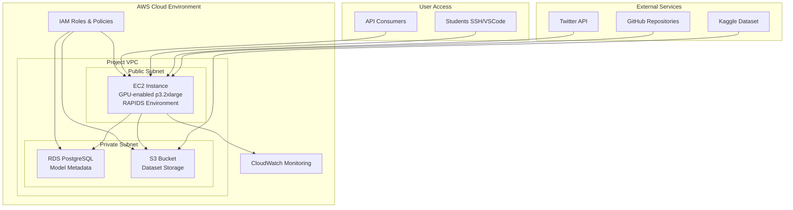

# Environment Setup Guide: Fake News Detection Project

## Overview
This guide provides step-by-step instructions for setting up the development environment for the Fake News Detection capstone project. The setup is tailored for each student's operating system and includes RAPIDS installation for GPU-accelerated machine learning.

## Important Notes
- **Instance Type**: Current EC2 instance is t3.medium (CPU-only). For full RAPIDS GPU acceleration, consider upgrading to g4dn.xlarge or p3.2xlarge.
- **Timeline**: Complete setup by November 15 for smooth project start.
- **Support**: Contact instructor for setup issues.

## AWS Infrastructure Overview

### Core Resources
- **EC2 Instance**: `i-0a444afe43fd747c7` (52.90.26.169) - Primary compute environment
- **S3 Bucket**: `fake-news-project-data-2025` - Data storage and model artifacts
- **IAM Users**: 8 individual student accounts with EC2 and S3 access
- **Region**: us-east-1 (N. Virginia) - Optimized for low latency

### Infrastructure Architecture


### Security & Access Control
- **IAM Users**: Individual accounts for each student with least-privilege access
- **Security Groups**: Network-level access control for EC2 instance
- **VPC Configuration**: Isolated network environment for secure development
- **CloudTrail**: Audit logging of all AWS API calls and resource changes

## Prerequisites

### System Requirements
- **RAM**: Minimum 4GB (8GB recommended)
- **Storage**: 20GB free space
- **Network**: Stable internet for package downloads
- **Permissions**: Administrator/sudo access

### Account Requirements
- **AWS Account**: With EC2 and S3 access
- **GitHub Account**: For repository access
- **API Keys**: Kaggle, NewsAPI, Twitter (optional for initial setup)

---

## Setup Instructions by Operating System

### For Windows Users (Group A: Elsa, Teddy; Group B: None)

#### 1. Install Python and Conda
```bash
# Download Miniconda for Windows
# Visit: https://docs.conda.io/en/latest/miniconda.html
# Install Miniconda3-latest-Windows-x86_64.exe

# Verify installation
conda --version
python --version
```

#### 2. Create Project Environment
```bash
# Create conda environment
conda create -n fake-news python=3.9 -y
conda activate fake-news

# Install basic packages
conda install -c conda-forge pandas numpy scikit-learn matplotlib jupyter -y
pip install requests tweepy kaggle
```

#### 3. Install RAPIDS (CPU Version)
```bash
# RAPIDS CPU installation
conda install -c rapidsai -c nvidia -c conda-forge rapids=23.10 python=3.9 -y

# Verify installation
python -c "import cudf; print('RAPIDS installed successfully')"
```

#### 4. Install Additional Tools
```bash
# Git (if not installed)
# Download from: https://git-scm.com/downloads

# AWS CLI v2 Installation for Windows
# Method 1: MSI Installer (Recommended)
# Download from: https://awscli.amazonaws.com/AWSCLIV2.msi
# Run the installer and follow the setup wizard

# Method 2: Command Line
curl "https://awscli.amazonaws.com/AWSCLIV2.msi" -o "AWSCLIV2.msi"
msiexec.exe /i AWSCLIV2.msi /quiet

# Verify installation
aws --version

# Configure AWS
aws configure
# Enter your access key, secret key, region (us-east-1), output format (json)
```

#### 5. Clone Project Repository
```bash
# Navigate to project directory
cd C:\Users\YourName\Desktop\fake-news-project

# Clone repository (replace with actual repo URL)
git clone https://github.com/your-org/fake-news-detection.git
cd fake-news-detection
```

#### 6. Verify Setup
```bash
# Run verification script
python verify_setup.py
```

### For Linux Users (Group A: Bismarck; Group B: Kigen, Lamech)

#### 1. Update System
```bash
# Ubuntu/Debian
sudo apt update && sudo apt upgrade -y

# Install essential packages
sudo apt install -y build-essential git curl wget
```

#### 2. Install Miniconda
```bash
# Download and install Miniconda
wget https://repo.anaconda.com/miniconda/Miniconda3-latest-Linux-x86_64.sh
bash Miniconda3-latest-Linux-x86_64.sh -b -p $HOME/miniconda
echo 'export PATH="$HOME/miniconda/bin:$PATH"' >> ~/.bashrc
source ~/.bashrc

# Verify
conda --version
```

#### 3. Create Project Environment
```bash
# Create environment
conda create -n fake-news python=3.9 -y
conda activate fake-news

# Install packages
conda install -c conda-forge pandas numpy scikit-learn matplotlib jupyter -y
pip install requests tweepy kaggle boto3 fastapi uvicorn
```

#### 4. Install RAPIDS
```bash
# For CPU-only systems (current EC2 t3.medium)
conda install -c rapidsai -c nvidia -c conda-forge rapids=23.10 python=3.9 -y

# For GPU systems (if upgraded)
# conda install -c rapidsai -c nvidia -c conda-forge rapids=23.10 python=3.9 cudatoolkit=11.8 -y

# Verify
python -c "import cudf; df = cudf.DataFrame({'test': [1,2,3]}); print(df)"
```

#### 5. Install AWS CLI
```bash
# AWS CLI v2 Installation for Linux
# Method 1: Direct Download (Recommended)
curl "https://awscli.amazonaws.com/awscli-exe-linux-x86_64.zip" -o "awscliv2.zip"
unzip awscliv2.zip
sudo ./aws/install

# Method 2: Using Package Manager (Ubuntu/Debian)
# sudo apt install awscli

# Method 3: Using Package Manager (RHEL/CentOS/Fedora)
# sudo yum install awscli  # or dnf install awscli

# Verify installation
aws --version

# Configure AWS
aws configure
# Enter your access key, secret key, region (us-east-1), output format (json)
```

#### 6. Setup Project Directory
```bash
# Create project structure
mkdir -p ~/fake-news-project/{data,models,notebooks,scripts}
cd ~/fake-news-project

# Clone repository
git clone https://github.com/your-org/fake-news-detection.git .
```

### For macOS Users (Group A: John; Group B: Wilberforce, Nehemiah)

#### 1. Install Homebrew (if not installed)
```bash
/bin/bash -c "$(curl -fsSL https://raw.githubusercontent.com/Homebrew/install/HEAD/install.sh)"
```

#### 2. Install Python and Conda
```bash
# Install Miniconda via Homebrew
brew install miniconda
conda init zsh  # or bash
source ~/.zshrc  # or ~/.bashrc

# Create environment
conda create -n fake-news python=3.9 -y
conda activate fake-news
```

#### 3. Install Packages
```bash
# Basic packages
conda install -c conda-forge pandas numpy scikit-learn matplotlib jupyter -y
pip install requests tweepy kaggle boto3 fastapi uvicorn

# RAPIDS (CPU version for macOS)
conda install -c rapidsai -c nvidia -c conda-forge rapids=23.10 python=3.9 -y
```

#### 4. Install Additional Tools
```bash
# AWS CLI v2 Installation for macOS
# Method 1: Homebrew (Recommended)
brew install awscli

# Method 2: Direct Download
curl "https://awscli.amazonaws.com/AWSCLIV2.pkg" -o "AWSCLIV2.pkg"
sudo installer -pkg AWSCLIV2.pkg -target /

# Verify installation
aws --version

# Git (usually pre-installed on macOS)
git --version

# Configure AWS
aws configure
# Enter your access key, secret key, region (us-east-1), output format (json)
```

#### 5. Setup Project
```bash
# Create directory
mkdir -p ~/Desktop/fake-news-project
cd ~/Desktop/fake-news-project

# Clone repo
git clone https://github.com/your-org/fake-news-detection.git .
```

---

## EC2 Instance Setup (All Groups)

### 1. Configure AWS on Local Machine
```bash
# First, configure AWS CLI on your local machine with the credentials provided
aws configure
# Enter your access key, secret key, region (us-east-1), output format (json)

# Verify AWS access
aws sts get-caller-identity
```

### 2. Connect to EC2
```bash
# After AWS is configured locally, connect to EC2 instance
chmod 400 fake-news-key.pem
ssh -i fake-news-key.pem ec2-user@52.90.26.169
```

### 3. Update EC2 System
```bash
# Update packages
sudo yum update -y

# Install essential tools
sudo yum install -y git htop tmux
```

### 4. Install Miniconda on EC2
```bash
# Download and install
wget https://repo.anaconda.com/miniconda/Miniconda3-latest-Linux-x86_64.sh
bash Miniconda3-latest-Linux-x86_64.sh -b -p $HOME/miniconda
echo 'export PATH="$HOME/miniconda/bin:$PATH"' >> ~/.bashrc
source ~/.bashrc
```

### 5. Setup RAPIDS Environment on EC2
```bash
# Create environment
conda create -n rapids-env python=3.9 -y
conda activate rapids-env

# Install RAPIDS (CPU version for t3.medium)
conda install -c rapidsai -c nvidia -c conda-forge rapids=23.10 python=3.9 -y

# Install additional packages
pip install requests tweepy kaggle boto3 fastapi uvicorn mlflow

# Verify
python -c "import cudf, cuml; print('RAPIDS ready')"
```

### 6. Configure AWS on EC2
```bash
# Configure AWS CLI on EC2 instance with your credentials
aws configure
# Use the same credentials as your local machine
```

### 7. Setup Project Structure on EC2
```bash
# Create group directories
sudo mkdir -p /home/ec2-user/{groupA,groupB}
sudo chown ec2-user:ec2-user /home/ec2-user/{groupA,groupB}

# For Group A members
cd /home/ec2-user/groupA
git clone https://github.com/your-org/fake-news-detection.git .

# For Group B members
cd /home/ec2-user/groupB
git clone https://github.com/your-org/fake-news-detection.git .
```

### 8. Run Verification
```bash
# In each group directory
cd /home/ec2-user/groupA  # or groupB
python verify_setup.py
```

---

## GPU Instance Upgrade (Optional but Recommended)

### Why Upgrade?
- Current t3.medium is CPU-only (2 vCPUs, 4GB RAM)
- RAPIDS GPU acceleration requires GPU instance
- Better performance for ML training

### Upgrade Steps
```bash
# Stop instance
aws ec2 stop-instances --instance-ids i-0a444afe43fd747c7

# Wait for stopped state, then modify
aws ec2 modify-instance-attribute \
  --instance-id i-0a444afe43fd747c7 \
  --instance-type g4dn.xlarge

# Start instance
aws ec2 start-instances --instance-ids i-0a444afe43fd747c7

# After starting, reinstall RAPIDS with GPU support
conda activate rapids-env
conda install -c rapidsai -c nvidia -c conda-forge rapids=23.10 python=3.9 cudatoolkit=11.8 -y
```

---

## Troubleshooting

### Common Issues

#### Conda Environment Issues
```bash
# Clean conda
conda clean --all -y

# Recreate environment
conda env remove -n fake-news
conda create -n fake-news python=3.9 -y
```

#### RAPIDS Installation Problems
```bash
# Check CUDA version (on GPU instances)
nvidia-smi

# Reinstall RAPIDS
conda install -c rapidsai -c nvidia -c conda-forge rapids -y
```

#### AWS Configuration Issues
```bash
# Check credentials
aws sts get-caller-identity

# Reconfigure
aws configure
```

#### Memory Issues
```bash
# Check system resources
free -h
df -h

# Use smaller datasets for testing
```

### Getting Help
- **Instructor**: Contact for environment-specific issues
- **Team Members**: Share successful setups
- **Documentation**: Check RAPIDS and AWS docs
- **Online Resources**: Stack Overflow, GitHub issues

---

## Verification Checklist

- [ ] Python 3.9+ installed
- [ ] Conda environment created and activated
- [ ] Required packages installed (pandas, sklearn, etc.)
- [ ] RAPIDS installed and functional
- [ ] AWS CLI configured
- [ ] Git repository cloned
- [ ] Project directories created
- [ ] Verification script passes
- [ ] SSH access to EC2 confirmed
- [ ] Team communication channels set up

## Next Steps
1. **Test ETL Pipeline**: Run `etl_pipeline.py` with sample data
2. **Explore Dataset**: Use Jupyter notebooks for data analysis
3. **Model Prototyping**: Build baseline sklearn models
4. **GPU Testing**: Compare CPU vs GPU performance (if GPU available)

Complete this setup by November 15 to ensure smooth project execution.