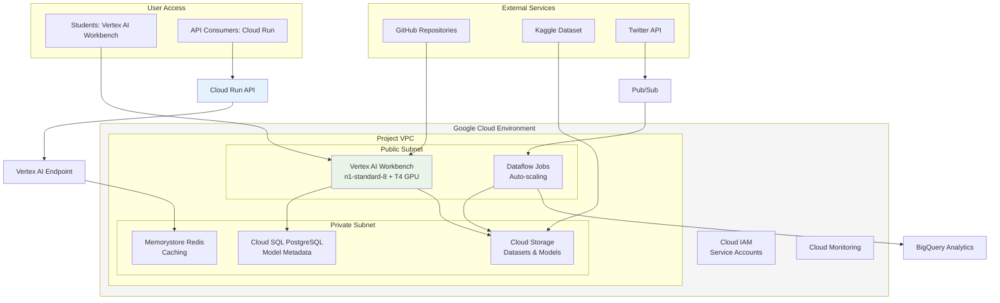

# Environment Setup Guide: Fake News Detection Project (GCP Version)

## Overview
This guide provides step-by-step instructions for setting up the development environment for the Fake News Detection capstone project on Google Cloud Platform. The setup includes Vertex AI Workbench configuration, Cloud Storage setup, Cloud IAM permissions, and RAPIDS GPU-accelerated machine learning following the NVIDIA DLI "Accelerate Data Science Workflows with Zero Code Changes" methodology.

## Important Notes
- **Instance Type**: Vertex AI Workbench with n1-standard-8 + T4 GPU for RAPIDS acceleration
- **GPU Acceleration**: RAPIDS cuML will provide zero-code-change acceleration
- **Timeline**: Complete setup by November 15 for smooth project start
- **Support**: Contact instructor for GCP-specific setup issues

## GCP Infrastructure Overview

### Core Resources
- **Project ID**: `fake-news-project`
- **Vertex AI Workbench**: Primary compute environment with GPU support (T4/A100)
- **Cloud Storage Bucket**: `gs://fake-news-project-data-2025` - Data storage and model artifacts
- **Cloud IAM**: 8 student service accounts with Vertex AI and Storage access
- **Region**: us-central1 - Optimized for low latency and compliance

### Infrastructure Architecture


### Security & Access Control
- **Cloud IAM**: Service accounts with least-privilege access
- **VPC Service Controls**: Additional security layer
- **Cloud Audit Logs**: Complete activity logging
- **Customer-Managed Encryption Keys**: Data encryption control

---

## Setup Instructions by Operating System

### For All Students (GCP Cloud Shell)

#### 1. Access Google Cloud Console
```bash
# Open Google Cloud Console in your browser
# https://console.cloud.google.com/

# Select your project or create a new one
# Enable billing if not already enabled
```

#### 2. Enable Required APIs
```bash
# Enable necessary APIs for the project
gcloud services enable compute.googleapis.com
gcloud services enable storage.googleapis.com
gcloud services enable iam.googleapis.com
gcloud services enable aiplatform.googleapis.com
gcloud services enable dataflow.googleapis.com
gcloud services enable run.googleapis.com
gcloud services enable bigquery.googleapis.com
gcloud services enable pubsub.googleapis.com
```

#### 3. Create Service Accounts for Students
```bash
# Create service accounts for each student
# Group A
gcloud iam service-accounts create bismark-student \
    --description="ML Engineer Service Account" \
    --display-name="Bismarck Student Account"

gcloud iam service-accounts create elsa-student \
    --description="Data Analyst Service Account" \
    --display-name="Elsa Student Account"

gcloud iam service-accounts create teddy-student \
    --description="QA Engineer Service Account" \
    --display-name="Teddy Student Account"

gcloud iam service-accounts create john-student \
    --description="Project Manager Service Account" \
    --display-name="John Student Account"

# Group B
gcloud iam service-accounts create wilberforce-student \
    --description="QA Engineer Service Account" \
    --display-name="Wilberforce Student Account"

gcloud iam service-accounts create nehemiah-student \
    --description="ML Engineer Service Account" \
    --display-name="Nehemiah Student Account"

gcloud iam service-accounts create kigen-student \
    --description="Project Manager Service Account" \
    --display-name="Kigen Student Account"

gcloud iam service-accounts create lamech-student \
    --description="Data Analyst Service Account" \
    --display-name="Lamech Student Account"
```

#### 4. Assign Roles to Service Accounts
```bash
# Assign necessary roles to each service account
# Vertex AI, Storage, and BigQuery access
for account in bismark elsa teddy john wilberforce nehemiah kigen lamech; do
    gcloud projects add-iam-policy-binding fake-news-project \
        --member="serviceAccount:${account}-student@fake-news-project.iam.gserviceaccount.com" \
        --role="roles/aiplatform.user"

    gcloud projects add-iam-policy-binding fake-news-project \
        --member="serviceAccount:${account}-student@fake-news-project.iam.gserviceaccount.com" \
        --role="roles/storage.admin"

    gcloud projects add-iam-policy-binding fake-news-project \
        --member="serviceAccount:${account}-student@fake-news-project.iam.gserviceaccount.com" \
        --role="roles/bigquery.user"

    gcloud projects add-iam-policy-binding fake-news-project \
        --member="serviceAccount:${account}-student@fake-news-project.iam.gserviceaccount.com" \
        --role="roles/monitoring.viewer"
done
```

#### 5. Create Cloud Storage Bucket
```bash
# Create bucket for project data
gsutil mb -p fake-news-project -c standard -l us-central1 gs://fake-news-project-data-2025/

# Set bucket permissions
gsutil iam ch serviceAccount:bismark-student@fake-news-project.iam.gserviceaccount.com:roles/storage.admin gs://fake-news-project-data-2025/
gsutil iam ch serviceAccount:elsa-student@fake-news-project.iam.gserviceaccount.com:roles/storage.admin gs://fake-news-project-data-2025/
# Repeat for all other service accounts
```

---

## Vertex AI Workbench Setup

### 1. Create Vertex AI Workbench Instance
```bash
# Create Vertex AI Workbench instance with RAPIDS-ready configuration
gcloud notebooks instances create fake-news-workbench \
    --vm-image-project=deeplearning-platform-release \
    --vm-image-family=tf-ent-2-8-cu113-notebooks \
    --machine-type=n1-standard-8 \
    --accelerator-type=NVIDIA_TESLA_T4 \
    --accelerator-count=1 \
    --location=us-central1-a \
    --metadata=startup-script='#!/bin/bash
        # Install RAPIDS following NVIDIA DLI methodology
        echo "Installing RAPIDS for zero-code-change acceleration..."
        
        # Install Miniconda if not present
        if ! command -v conda &> /dev/null; then
            wget https://repo.anaconda.com/miniconda/Miniconda3-latest-Linux-x86_64.sh
            bash Miniconda3-latest-Linux-x86_64.sh -b -p /opt/miniconda
            echo "export PATH=/opt/miniconda/bin:$PATH" >> /etc/profile
        fi
        
        # Create RAPIDS environment
        /opt/miniconda/bin/conda create -n rapids-env python=3.9 -y
        source /opt/miniconda/bin/activate rapids-env
        
        # Install RAPIDS with GPU support (following NVIDIA DLI workflow)
        /opt/miniconda/bin/conda install -c rapidsai -c nvidia -c conda-forge \
            rapids=23.10 python=3.9 cudatoolkit=11.8 -y
        
        # Install additional ML and data science packages
        pip install scikit-learn pandas numpy matplotlib seaborn plotly
        pip install nltk spacy transformers torch torchvision torchaudio
        pip install google-cloud-storage google-cloud-bigquery google-auth
        pip install fastapi uvicorn mlflow jupyterlab
        
        # Download NLTK data
        python -c "import nltk; nltk.download('stopwords'); nltk.download('punkt')"
        
        # Configure Jupyter for RAPIDS
        jupyter lab --generate-config
        echo "c.InteractiveShellApp.extensions.append('cudf.pandas')" >> ~/.jupyter/jupyter_lab_config.py
        
        echo "RAPIDS GPU acceleration environment setup complete"
    ' \
    --network=default \
    --subnet=default \
    --no-public-ip \
    --service-account=bismark-student@fake-news-project.iam.gserviceaccount.com
```

### 2. Configure Firewall Rules
```bash
# Allow HTTPS access to Vertex AI Workbench
gcloud compute firewall-rules create allow-vertex-ai \
    --allow=tcp:80,tcp:443,tcp:8888 \
    --source-ranges=0.0.0.0/0 \
    --description="Allow access to Vertex AI Workbench"
```

### 3. Create Project Directory Structure
```bash
# Access the Vertex AI Workbench instance
# Open Jupyter Lab in your browser

# Create directory structure in Jupyter terminal
mkdir -p ~/fake-news-project/{groupA,groupB}
mkdir -p ~/fake-news-project/groupA/{data,models,notebooks,scripts}
mkdir -p ~/fake-news-project/groupB/{data,models,notebooks,scripts}

# Clone project repository
cd ~/fake-news-project
git clone https://github.com/Eldohub-data-scientists/Data-Science-2025.git .
```

### 4. Configure Cloud SDK on Vertex AI
```bash
# Configure project and authentication
gcloud config set project fake-news-project
gcloud config set compute/zone us-central1-a

# Test authentication
gcloud auth list
gsutil ls gs://fake-news-project-data-2025/
```

---

## RAPIDS Environment Setup (Following NVIDIA DLI)

### 1. Activate RAPIDS Environment
```bash
# In Vertex AI Workbench Jupyter terminal
source /opt/miniconda/bin/activate rapids-env

# Verify RAPIDS installation (following NVIDIA DLI methodology)
python -c "
import cudf
import cuml
print('RAPIDS cuDF version:', cudf.__version__)
print('RAPIDS cuML version:', cuml.__version__)
print('Zero-code-change GPU acceleration ready!')
"

# Test cuDF pandas accelerator mode
python -c "
import cudf.pandas  # Enable zero-code-change acceleration
import pandas as pd
import time

# Create sample dataset
df = pd.DataFrame({'text': ['fake news story'] * 100000, 'label': [0,1] * 50000})

# Measure performance with GPU acceleration
start = time.time()
result = df.groupby('label').size()
end = time.time()

print(f'GPU-accelerated groupby completed in {end-start:.2f} seconds')
print('RAPIDS zero-code-change acceleration working!')
"
```

### 2. Configure cuDF pandas Accelerator Mode
```python
# In Jupyter notebook - enable zero-code-change acceleration
import cudf.pandas  # This enables GPU acceleration for all pandas operations
import pandas as pd

# Now all pandas operations are automatically GPU-accelerated
df = pd.read_csv('gs://fake-news-project-data-2025/datasets/kaggle_data.csv')
processed_df = df.dropna()  # GPU accelerated
grouped_df = df.groupby('label').mean()  # GPU accelerated

print("All pandas operations now GPU-accelerated with zero code changes!")
```

### 3. Configure cuML for ML Acceleration
```python
# In Jupyter notebook - unified CPU/GPU ML experience
from cuml.ensemble import RandomForestClassifier
from sklearn.ensemble import RandomForestClassifier as SklearnRF
import time

# Load data
X = processed_df[['feature1', 'feature2']]  # Your features
y = processed_df['label']

# Compare sklearn (CPU) vs cuML (GPU)
# CPU version
start = time.time()
cpu_model = SklearnRF(n_estimators=100)
cpu_model.fit(X, y)
cpu_time = time.time() - start

# GPU version (same API, automatic acceleration)
start = time.time()
gpu_model = RandomForestClassifier(n_estimators=100)
gpu_model.fit(X, y)
gpu_time = time.time() - start

print(f"CPU Time: {cpu_time:.2f}s")
print(f"GPU Time: {gpu_time:.2f}s")
print(f"Speedup: {cpu_time/gpu_time:.1f}x")
```

### 4. Configure cuGraph for Network Analysis
```python
# In Jupyter notebook - GPU-accelerated graph analytics
import cudf
import cugraph
import networkx as nx

# Create sample graph data (fake news propagation network)
edges_df = cudf.DataFrame({
    'src': [0, 1, 2, 3, 4],
    'dst': [1, 2, 3, 4, 0],
    'weight': [1.0, 2.0, 1.5, 3.0, 2.5]
})

# Create GPU-accelerated graph
G = cugraph.Graph()
G.from_cudf_edgelist(edges_df, source='src', destination='dst', edge_attr='weight')

# Compute betweenness centrality (GPU accelerated)
start = time.time()
betweenness = cugraph.betweenness_centrality(G)
gpu_time = time.time() - start

print(f"GPU betweenness centrality computed in {gpu_time:.2f} seconds")
print("cuGraph GPU acceleration working!")
```

---

## GPU Instance Upgrade (Optional but Recommended)

### Why Upgrade?
- Current n1-standard-8 + T4 provides good GPU acceleration
- A100 GPUs offer even better performance for RAPIDS workloads
- Better performance for complex ML models and large datasets

### GPU Instance Types Available
- **A100 GPUs**: 40GB VRAM, excellent for RAPIDS cuML/cuDF
- **V100 GPUs**: 16GB/32GB VRAM, good performance/cost ratio
- **T4 GPUs**: 16GB VRAM, current setup, good for learning

### Upgrade Process
```bash
# Stop the current Vertex AI instance
gcloud notebooks instances stop fake-news-workbench --location=us-central1-a

# Update with better GPU
gcloud notebooks instances update fake-news-workbench \
    --accelerator-type=NVIDIA_TESLA_A100 \
    --accelerator-count=1 \
    --location=us-central1-a

# Start the upgraded instance
gcloud notebooks instances start fake-news-workbench --location=us-central1-a
```

### GPU Verification
```bash
# Verify GPU in Jupyter terminal
nvidia-smi
nvcc --version

# Test RAPIDS with A100
python -c "
import cudf
print('RAPIDS cuDF running on A100 GPU')
df = cudf.DataFrame({'test': range(1000000)})
print(f'GPU DataFrame created with {len(df)} rows')
"
```

---

## Student Access Setup

### 1. Generate Service Account Keys
```bash
# Generate JSON keys for each student
for account in bismark elsa teddy john wilberforce nehemiah kigen lamech; do
    gcloud iam service-accounts keys create ${account}-key.json \
        --iam-account=${account}-student@fake-news-project.iam.gserviceaccount.com
    
    # Securely share the key file with the student
    echo "Created key for ${account}"
done
```

### 2. Configure Local Development Environment
```bash
# Students should install Google Cloud SDK locally
# macOS
brew install google-cloud-sdk

# Linux
curl https://sdk.cloud.google.com | bash

# Windows - download installer from Google Cloud website

# Initialize
gcloud init
gcloud auth activate-service-account --key-file=path/to/your-key.json
```

### 3. Access Vertex AI Workbench
```bash
# Open Vertex AI Workbench in Cloud Console
# https://console.cloud.google.com/vertex-ai/workbench

# Select your instance: fake-news-workbench
# Click "OPEN JUPYTERLAB"

# Your RAPIDS-accelerated environment is ready!
```

---

## Monitoring & Cost Management

### 1. Setup Cloud Monitoring
```bash
# Create monitoring dashboard
gcloud monitoring dashboards create fake-news-dashboard \
    --config-from-file=dashboard-config.json

# Setup alerts for GPU usage
gcloud alpha monitoring policies create gpu-alert \
    --policy-from-file=gpu-alert-config.json
```

### 2. Cost Monitoring
```bash
# Set up billing alerts
gcloud billing budgets create fake-news-budget \
    --billing-account=YOUR_BILLING_ACCOUNT \
    --display-name="Fake News Project Budget" \
    --amount=300.00 \
    --currency=USD
```

### 3. Resource Monitoring in Vertex AI
```python
# Monitor GPU usage in Jupyter notebook
import subprocess
result = subprocess.run(['nvidia-smi'], capture_output=True, text=True)
print(result.stdout)

# Monitor memory usage
import psutil
print(f"CPU Memory: {psutil.virtual_memory().percent}%")
print(f"GPU Memory: Check nvidia-smi output")
```

---

## RAPIDS Workflow Integration (NVIDIA DLI)

### Data Loading & ETL Phase
```python
# Enable zero-code-change acceleration
import cudf.pandas  # Automatically accelerates pandas
import pandas as pd

# All pandas operations now GPU-accelerated
df = pd.read_csv('gs://fake-news-project-data-2025/datasets/kaggle_data.csv')
cleaned_df = df.dropna()  # GPU accelerated
processed_df = cleaned_df.apply(lambda x: x.str.lower())  # GPU accelerated
```

### Model Training & Analytics Phase
```python
# Unified ML experience - same API for CPU/GPU
from cuml.ensemble import RandomForestClassifier as GPU_RF
from sklearn.ensemble import RandomForestClassifier as CPU_RF

# GPU training (automatic acceleration)
gpu_model = GPU_RF(n_estimators=100)
gpu_model.fit(X_train, y_train)

# CPU training (for comparison)
cpu_model = CPU_RF(n_estimators=100)
cpu_model.fit(X_train, y_train)

# Same prediction API
gpu_predictions = gpu_model.predict(X_test)
cpu_predictions = cpu_model.predict(X_test)
```

### Model Inference & Deployment Phase
```python
# GPU-accelerated inference
gpu_predictions = gpu_model.predict_proba(X_new)
confidence_scores = gpu_predictions.max(axis=1)

# Deploy to Vertex AI Endpoint
from google.cloud import aiplatform

endpoint = aiplatform.Endpoint.create(display_name="fake-news-endpoint")
endpoint.deploy(model=gpu_model, machine_type="n1-standard-4")
```

---

## Troubleshooting

### Common Issues

#### RAPIDS Installation Problems
```bash
# Clean and reinstall
conda env remove -n rapids-env
conda create -n rapids-env python=3.9 -y
conda activate rapids-env
conda install -c rapidsai -c nvidia -c conda-forge rapids=23.10 python=3.9 cudatoolkit=11.8 -y
```

#### GPU Driver Issues
```bash
# Check GPU status
nvidia-smi

# Restart Vertex AI instance if needed
gcloud notebooks instances reset fake-news-workbench --location=us-central1-a
```

#### Authentication Issues
```bash
# Re-authenticate service account
gcloud auth activate-service-account --key-file=path/to/key.json

# Check permissions
gcloud iam service-accounts get-iam-policy \
    bismark-student@fake-news-project.iam.gserviceaccount.com
```

#### Memory Issues
```bash
# Monitor GPU memory
nvidia-smi --query-gpu=memory.used,memory.total --format=csv

# Clear GPU memory
import torch
torch.cuda.empty_cache()
```

### Performance Optimization
- Use `cudf.pandas` for automatic GPU acceleration
- Batch operations for better GPU utilization
- Monitor GPU memory usage regularly
- Use appropriate data types to save memory

---

## Verification Checklist

- [ ] GCP project created and billing enabled
- [ ] Required APIs enabled (Compute, Storage, AI Platform, etc.)
- [ ] Service accounts created for all 8 students
- [ ] IAM roles assigned (Vertex AI User, Storage Admin)
- [ ] Cloud Storage bucket created
- [ ] Vertex AI Workbench instance created and running
- [ ] RAPIDS environment installed and activated
- [ ] cuDF pandas accelerator mode working
- [ ] cuML GPU acceleration functional
- [ ] Jupyter Lab accessible and configured

## Next Steps
1. **Test RAPIDS Acceleration**: Run the verification script
2. **Explore Dataset**: Use GPU-accelerated pandas operations
3. **Model Prototyping**: Compare CPU vs GPU performance
4. **Team Development**: Begin collaborative development

Complete this setup by November 15 to ensure smooth project execution with full RAPIDS GPU acceleration on Google Cloud Platform.