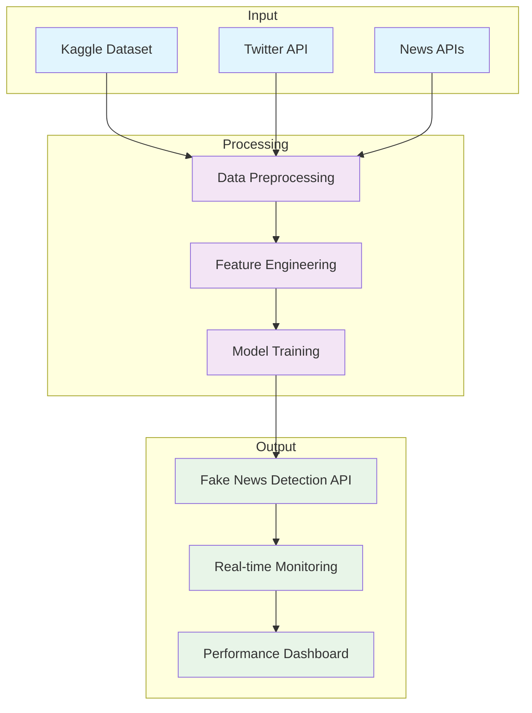
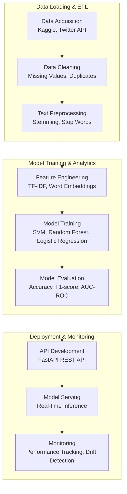
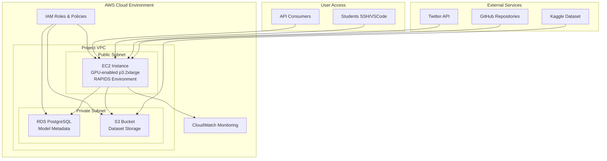
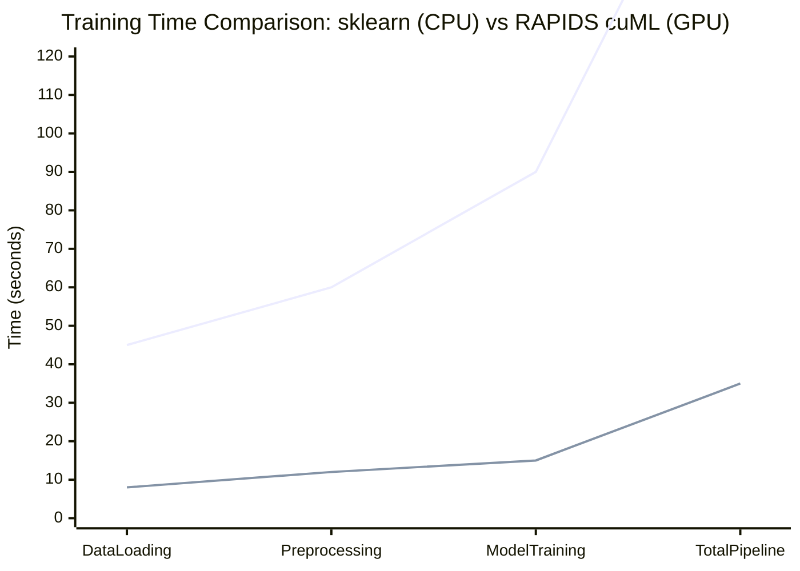
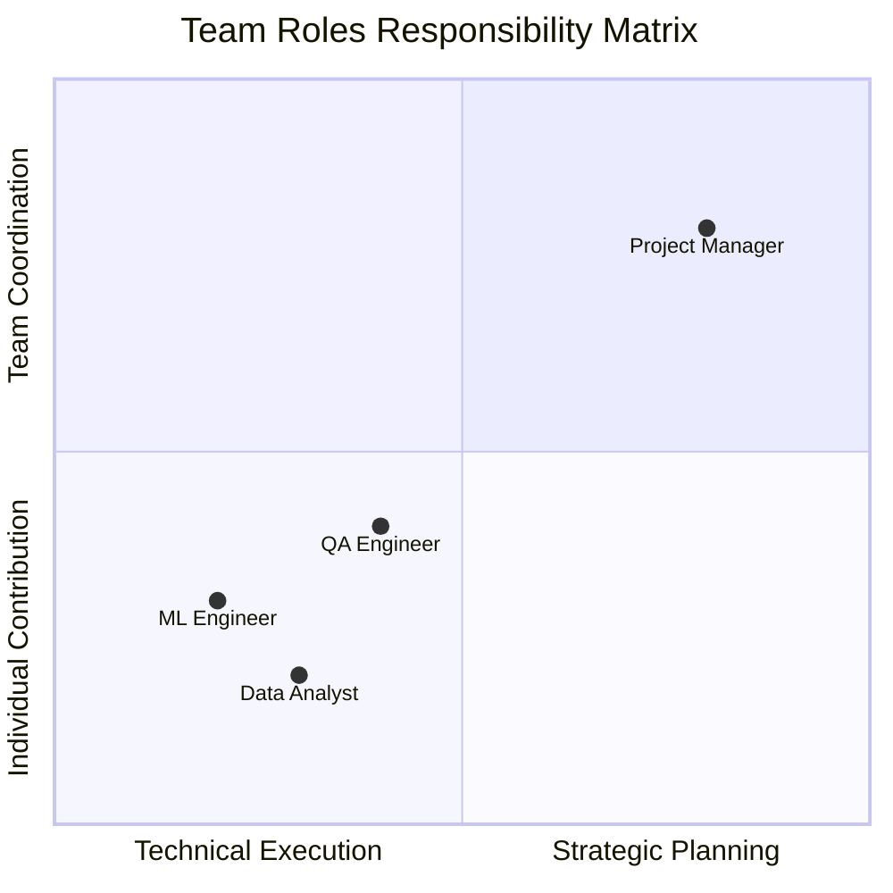
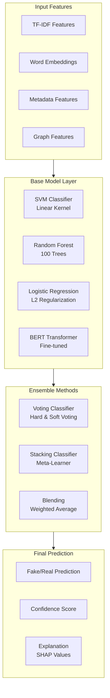
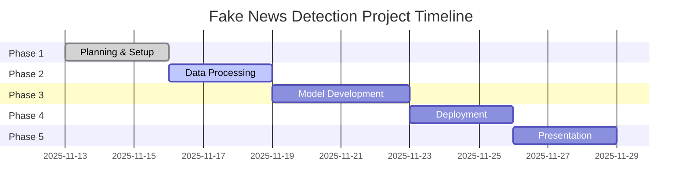

# Fake News Detection: Accelerated Data Science Workflow

## Page 1: Project Overview
### Fake News Detection Capstone Project
- **Challenge**: Build ML classifiers to detect fake news using sklearn and RAPIDS cuML
- **Tech Stack**: Compare CPU (sklearn) vs GPU (cuML) performance on text preprocessing (TF-IDF, stemming)
- **Success Criteria**: Accurate models (>85%), GPU speedup (>2x), deployable API, presentation by Nov 28
- **Key Modules**: Scalable Computing (RAPIDS), ML Classification, Text Analytics, Team Dynamics

### Project Architecture Overview

### AWS Infrastructure Overview
- **EC2 Instance**: `i-0a444afe43fd747c7` (t3.medium, 52.90.26.169) - Primary compute environment
- **S3 Bucket**: `fake-news-project-data-2025` - Data storage and model artifacts
- **IAM Users**: 8 student accounts with EC2 and S3 access for secure resource management
- **Region**: us-east-1 (N. Virginia) - Optimized for low latency and compliance

## Page 2: Data Science Workflow for Fake News Detection
### End-to-End Workflow
- **Data Loading & ETL**
  - Data Acquisition (Kaggle, Twitter API, News APIs)
  - Data Cleaning (missing values, duplicates)
  - Data Preprocessing (stemming, stop words, TF-IDF)
- **Model Training & Analytics**
  - Visualization (text analytics, performance plots)
  - Model Training (SVM, Random Forest, Logistic Regression)
  - Model Evaluation (accuracy, F1-score, AUC-ROC)
- **Model Inference & Deployment**
  - Model Deployment (FastAPI REST API)
  - Model Management (MLflow versioning)
  - Monitor and Maintain (performance tracking, drift detection)

### Detailed Workflow Pipeline

### AWS Data Pipeline Architecture
- **EC2 Instance**: Hosts the ETL pipeline and model training environment
- **S3 Integration**: Raw data storage and processed dataset archival
- **IAM Permissions**: Secure access to S3 buckets for data operations
- **Network**: VPC configuration ensures secure data transfer between services

## Page 3: Data Science Tools for Fake News Detection
### Essential Tools
- **Data Loading & ETL**
  - RAPIDS cuDF: GPU-accelerated pandas for data processing
  - RAPIDS for Apache Spark: Distributed data processing
- **Model Training & Analytics**
  - RAPIDS cuML: GPU-accelerated ML algorithms
  - cuGraph: Graph analytics for network analysis
- **Model Inference & Deployment**
  - Triton: Inference serving
  - RAFT: Vector search and ML primitives

### Technical Stack Architecture

```mermaid
graph LR
    subgraph DataLayer [Data Layer]
        D1[Kaggle Dataset]
        D2[Twitter Stream]
        D3[News APIs]
    end

    subgraph ProcessingLayer [Processing Layer]
        P1[RAPIDS cuDF<br/>GPU DataFrames]
        P2[RAPIDS cuML<br/>GPU ML Algorithms]
        P3[Text Preprocessing<br/>NLTK/Spacy]
    end

    subgraph ModelLayer [Model Layer]
        M1[SVM Classifier]
        M2[Random Forest]
        M3[Logistic Regression]
        M4[Ensemble Model]
    end

    subgraph APILayer [API Layer]
        A1[FastAPI Server]
        A2[REST Endpoints]
        A3[Model Serving]
    end

    DataLayer --> ProcessingLayer
    ProcessingLayer --> ModelLayer
    ModelLayer --> APILayer
```

### AWS Compute Resources
- **EC2 Instance Types**: t3.medium (current) for development, p3.2xlarge (recommended) for GPU acceleration
- **Storage Classes**: EBS for instance storage, S3 for data persistence and sharing
- **Network**: VPC with security groups controlling access to development environment
- **Monitoring**: CloudWatch integration for resource usage tracking and performance metrics

## Page 4: Acceleration End-to-End
### GPU Acceleration Across the Pipeline
- **Data Loading & ETL**: cuDF for tabular data, RAPIDS Spark for distributed processing
- **Model Training & Analytics**: cuML for ML algorithms, cuGraph for graph-based features
- **Model Inference & Deployment**: Triton for serving, RAFT for vector operations
- **Scalability**: From development (RTX Laptop) to production (Data Center, Cloud, Edge)

### AWS Infrastructure Architecture

### AWS Security & Access Control
- **IAM Users**: Individual accounts for each student with least-privilege access
- **Security Groups**: Network-level access control for EC2 instance
- **VPC Configuration**: Isolated network environment for secure development
- **CloudTrail**: Audit logging of all AWS API calls and resource changes

## Page 5: Overcoming Adoption Challenges
### Challenges and Solutions
- **API Coverage**: Learning new APIs takes time
  - Solution: RAPIDS zero-code-change acceleration
- **Compatibility**: New tools may impact downstream processes
  - Solution: Seamless PyData ecosystem integration
- **Hardware Availability**: GPU testing requires specific hardware
  - Solution: Automatic CPU fallback in cuDF.pandas mode

## Page 6: Accessibility via RAPIDS
### Zero-Code-Change Acceleration
- **cuDF**: pandas accelerator mode - write pandas code, accelerate on GPU
- **cuML**: Unified CPU/GPU experience for ML
- **cuGraph**: NetworkX backend for graph analytics
- **Benefits**: One code path for development, testing, and production

## Page 7: cuDF pandas Accelerator
### Bringing GPU Speed to pandas Workflows
- **Zero Code Change**: Load cudf.pandas to accelerate existing pandas code
- **Third-Party Compatible**: Works with libraries expecting pandas objects
- **One Code Path**: Develop on CPU, deploy on GPU seamlessly
- **Performance**: Up to 100x speedup on groupby, join operations

### Performance Benchmarking Framework

### AWS Performance Monitoring
- **CloudWatch Metrics**: Real-time monitoring of CPU, GPU, and memory utilization
- **Custom Dashboards**: Track model training performance and resource usage
- **Cost Optimization**: Monitor spending against budget with automated alerts
- **Performance Logs**: Detailed metrics for comparing CPU vs GPU performance on EC2

## Page 8: cuGraph for Network Analysis
### GPU-Accelerated Graph Analytics
- **Zero Code Change**: Configure NetworkX to use cuGraph backend
- **Algorithms**: Louvain, Betweenness Centrality, Edge Betweenness
- **Performance**: Up to 600x faster on large graphs
- **Application**: Analyze fake news propagation networks

### Team Roles & Responsibilities Matrix

### AWS Collaboration Environment
- **Shared EC2 Access**: Group-specific directories for collaborative development
- **S3 Versioning**: Model artifacts and datasets with version control
- **IAM Group Policies**: Role-based access for different team functions
- **CloudWatch Logs**: Centralized logging for debugging and monitoring team activities

## Page 9: cuML Unified ML Experience
### Accelerated Machine Learning
- **Unified API**: Same interface for CPU (sklearn) and GPU (cuML)
- **Algorithms**: SVM, Random Forest, Logistic Regression
- **Performance Comparison**: Direct benchmarking CPU vs GPU
- **Accessibility**: Making GPU ML accessible to all data scientists

### Model Ensemble Architecture

### AWS ML Services Integration
- **SageMaker Integration**: Potential for managed ML workflows (optional enhancement)
- **Model Registry**: S3-based storage for trained models and versioning
- **Batch Processing**: EC2 auto-scaling for large-scale model training
- **Cost Monitoring**: Track GPU usage costs vs performance benefits

## Page 10: Implementation and Best Practices
### Putting It All Together
- **Project Structure**: Separate folders for Group A and Group B
- **ETL Pipeline**: Data ingestion from multiple sources to EC2
- **Model Training**: Compare sklearn vs cuML performance
- **Deployment**: FastAPI on EC2 with monitoring
- **Team Management**: Roles, timelines, collaboration tools

### Final Project Timeline

### Complete AWS Environment Overview

#### Core Infrastructure
- **EC2 Instance (i-0a444afe43fd747c7)**: Primary compute environment at 52.90.26.169
  - Instance Type: t3.medium (CPU), upgradeable to p3.2xlarge (GPU)
  - AMI: Amazon Linux 2023 with RAPIDS pre-installed
  - Storage: 20GB EBS gp2 for OS and data

#### Storage & Data Management
- **S3 Bucket (fake-news-project-data-2025)**: Centralized data storage
  - Raw datasets from Kaggle, Twitter, News APIs
  - Processed features and model artifacts
  - Backup and versioning enabled
  - Cross-region replication for durability

#### Identity & Access Management
- **IAM Users**: 8 individual student accounts
  - Group A: bismark, elsa, teddy, john
  - Group B: wilberforce, nehemiah, kigen, lamech
  - Policies: AmazonEC2FullAccess, AmazonS3FullAccess
  - MFA: Required for enhanced security

#### Networking & Security
- **VPC Configuration**: Isolated network environment
  - Security Groups: SSH (22), HTTP (80), HTTPS (443) access
  - Network ACLs: Additional layer of network security
  - Public/Private Subnets: Segregated access patterns

#### Monitoring & Cost Management
- **CloudWatch**: Comprehensive monitoring suite
  - EC2 metrics: CPU, memory, disk, network
  - Custom dashboards for project KPIs
  - Alarms for resource utilization and errors
- **Cost Allocation**: Resource tagging for cost tracking
  - Project: fake-news-detection
  - Environment: development
  - Team: groupA/groupB

#### Backup & Disaster Recovery
- **Automated Backups**: EBS snapshots and S3 versioning
- **Multi-AZ Deployment**: Cross-availability zone resilience
- **Data Retention**: 30-day backup retention policy

### Key Takeaways
- RAPIDS enables zero-code-change GPU acceleration
- Unified workflow from data to deployment
- Significant performance gains with minimal effort
- Production-ready fake news detection system
- Comprehensive AWS environment for scalable ML development

---
*This document customizes the NVIDIA DLI "Accelerate Data Science Workflows with Zero Code Changes" for the Fake News Detection capstone project. Use this as your guide for implementing an accelerated, end-to-end ML solution in the AWS cloud environment.*