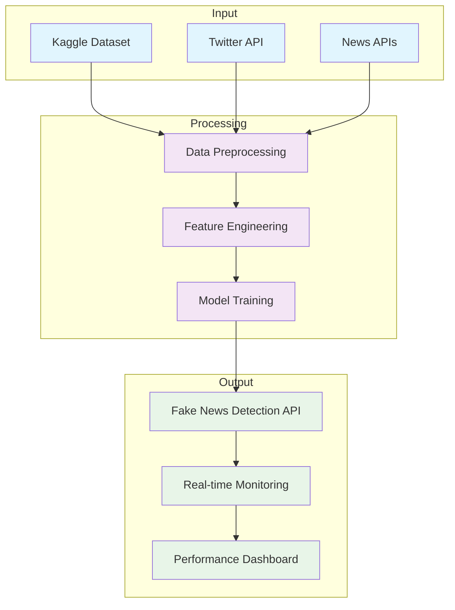
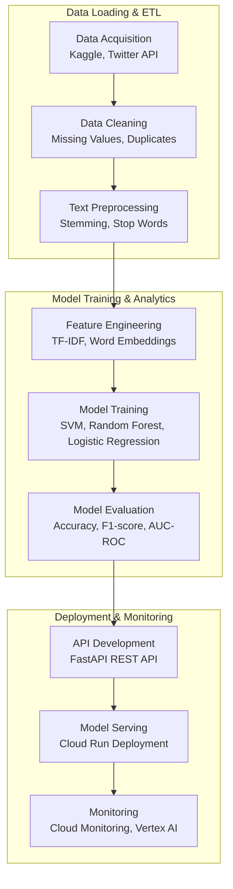
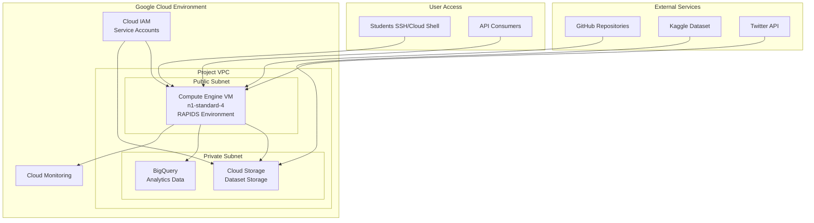

# Fake News Detection: Accelerated Data Science Workflow (GCP Version)

## Page 1: Project Overview
### Fake News Detection Capstone Project
- **Challenge**: Build ML classifiers to detect fake news using sklearn and RAPIDS cuML
- **Tech Stack**: Compare CPU (sklearn) vs GPU (cuML) performance on text preprocessing (TF-IDF, stemming)
- **Success Criteria**: Accurate models (>85%), GPU speedup (>2x), deployable API, presentation by Nov 28
- **Key Modules**: Scalable Computing (RAPIDS), ML Classification, Text Analytics, Team Dynamics

### Project Architecture Overview

### Google Cloud Infrastructure Overview
- **Compute Engine VM**: `fake-news-instance` (n1-standard-4, external IP) - Primary compute environment
- **Cloud Storage Bucket**: `fake-news-project-data-2025` - Data storage and model artifacts
- **Cloud IAM**: 8 student service accounts with Compute Engine and Storage access
- **Region**: us-central1 - Optimized for low latency and compliance

## Page 2: Data Science Workflow for Fake News Detection
### End-to-End Workflow
- **Data Loading & ETL**
  - Data Acquisition (Kaggle, Twitter API, News APIs)
  - Data Cleaning (missing values, duplicates)
  - Data Preprocessing (stemming, stop words, TF-IDF)
- **Model Training & Analytics**
  - Visualization (text analytics, performance plots)
  - Model Training (SVM, Random Forest, Logistic Regression)
  - Model Evaluation (accuracy, F1-score, AUC-ROC)
- **Model Inference & Deployment**
  - Model Deployment (FastAPI REST API on Cloud Run)
  - Model Management (Vertex AI Model Registry)
  - Monitor and Maintain (performance tracking, drift detection)

### Detailed Workflow Pipeline

### GCP Data Pipeline Architecture
- **Compute Engine VM**: Hosts the ETL pipeline and model training environment
- **Cloud Storage Integration**: Raw data storage and processed dataset archival
- **Cloud IAM Permissions**: Secure access to Cloud Storage buckets for data operations
- **VPC Network**: Secure data transfer between services

## Page 3: Data Science Tools for Fake News Detection
### Essential Tools
- **Data Loading & ETL**
  - RAPIDS cuDF: GPU-accelerated pandas for data processing
  - RAPIDS for Apache Spark: Distributed data processing
- **Model Training & Analytics**
  - RAPIDS cuML: GPU-accelerated ML algorithms
  - cuGraph: Graph analytics for network analysis
- **Model Inference & Deployment**
  - Vertex AI: Managed ML platform
  - Cloud Run: Serverless container deployment

### Technical Stack Architecture

```mermaid
graph LR
    subgraph DataLayer [Data Layer]
        D1[Kaggle Dataset]
        D2[Twitter Stream]
        D3[News APIs]
    end

    subgraph ProcessingLayer [Processing Layer]
        P1[RAPIDS cuDF<br/>GPU DataFrames]
        P2[RAPIDS cuML<br/>GPU ML Algorithms]
        P3[Text Preprocessing<br/>NLTK/Spacy]
    end

    subgraph ModelLayer [Model Layer]
        M1[SVM Classifier]
        M2[Random Forest]
        M3[Logistic Regression]
        M4[Ensemble Model]
    end

    subgraph APILayer [API Layer]
        A1[FastAPI Server]
        A2[Cloud Run Service]
        A3[Vertex AI Endpoints]
    end

    DataLayer --> ProcessingLayer
    ProcessingLayer --> ModelLayer
    ModelLayer --> APILayer
```

### GCP Compute Resources
- **Compute Engine Instance Types**: n1-standard-4 (current) for development, a2-highgpu-1g (recommended) for GPU acceleration
- **Storage Classes**: Persistent Disk for instance storage, Cloud Storage for data persistence and sharing
- **Network**: VPC with firewall rules controlling access to development environment
- **Monitoring**: Cloud Monitoring integration for resource usage tracking and performance metrics

## Page 4: Acceleration End-to-End
### GPU Acceleration Across the Pipeline
- **Data Loading & ETL**: cuDF for tabular data, RAPIDS Spark for distributed processing
- **Model Training & Analytics**: cuML for ML algorithms, cuGraph for graph-based features
- **Model Inference & Deployment**: Vertex AI for serving, custom GPU containers
- **Scalability**: From development (local GPU) to production (Cloud AI, serverless)

### GCP Infrastructure Architecture

### GCP Security & Access Control
- **Cloud IAM**: Service accounts for each student with least-privilege access
- **VPC Firewall**: Network-level access control for Compute Engine instances
- **VPC Configuration**: Isolated network environment for secure development
- **Cloud Audit Logs**: Audit logging of all GCP API calls and resource changes

## Page 5: Overcoming Adoption Challenges
### Challenges and Solutions
- **API Coverage**: Learning new APIs takes time
  - Solution: RAPIDS zero-code-change acceleration
- **Compatibility**: New tools may impact downstream processes
  - Solution: Seamless PyData ecosystem integration
- **Hardware Availability**: GPU testing requires specific hardware
  - Solution: GCP GPU instances with RAPIDS pre-installed

## Page 6: Accessibility via RAPIDS
### Zero-Code-Change Acceleration
- **cuDF**: pandas accelerator mode - write pandas code, accelerate on GPU
- **cuML**: Unified CPU/GPU experience for ML
- **cuGraph**: NetworkX backend for graph analytics
- **Benefits**: One code path for development, testing, and production

## Page 7: cuDF pandas Accelerator
### Bringing GPU Speed to pandas Workflows
- **Zero Code Change**: Load cudf.pandas to accelerate existing pandas code
- **Third-Party Compatible**: Works with libraries expecting pandas objects
- **One Code Path**: Develop on CPU, deploy on GPU seamlessly
- **Performance**: Up to 100x speedup on groupby, join operations

### Performance Benchmarking Framework

### GCP Performance Monitoring
- **Cloud Monitoring**: Real-time monitoring of CPU, GPU, and memory utilization
- **Custom Dashboards**: Track model training performance and resource usage
- **Cost Optimization**: Monitor spending against budget with automated alerts
- **Performance Logs**: Detailed metrics for comparing CPU vs GPU performance on Compute Engine

## Page 8: cuGraph for Network Analysis
### GPU-Accelerated Graph Analytics
- **Zero Code Change**: Configure NetworkX to use cuGraph backend
- **Algorithms**: Louvain, Betweenness Centrality, Edge Betweenness
- **Performance**: Up to 600x faster on large graphs
- **Application**: Analyze fake news propagation networks

### Team Roles & Responsibilities Matrix

### GCP Collaboration Environment
- **Shared VM Access**: Group-specific directories for collaborative development
- **Cloud Storage Versioning**: Model artifacts and datasets with version control
- **Cloud IAM**: Role-based access for different team functions
- **Cloud Logging**: Centralized logging for debugging and monitoring team activities

## Page 9: cuML Unified ML Experience
### Accelerated Machine Learning
- **Unified API**: Same interface for CPU (sklearn) and GPU (cuML)
- **Algorithms**: SVM, Random Forest, Logistic Regression
- **Performance Comparison**: Direct benchmarking CPU vs GPU
- **Accessibility**: Making GPU ML accessible to all data scientists

### Model Ensemble Architecture

### GCP ML Services Integration
- **Vertex AI**: Managed ML platform for model training and deployment
- **Model Registry**: Cloud Storage-based storage for trained models and versioning
- **AI Platform**: Scalable training with GPU support
- **Cost Monitoring**: Track GPU usage costs vs performance benefits

## Page 10: Implementation and Best Practices
### Putting It All Together
- **Project Structure**: Separate folders for Group A and Group B
- **ETL Pipeline**: Data ingestion from multiple sources to Compute Engine
- **Model Training**: Compare sklearn vs cuML performance
- **Deployment**: FastAPI on Cloud Run with Vertex AI monitoring
- **Team Management**: Roles, timelines, collaboration tools

### Final Project Timeline

### Complete GCP Environment Overview

#### Core Infrastructure
- **Compute Engine VM (fake-news-instance)**: Primary compute environment
  - Instance Type: n1-standard-4 (CPU), upgradeable to a2-highgpu-1g (GPU)
  - OS: Ubuntu 20.04 with RAPIDS pre-installed
  - Storage: 50GB SSD persistent disk

#### Storage & Data Management
- **Cloud Storage Bucket (fake-news-project-data-2025)**: Centralized data storage
  - Raw datasets from Kaggle, Twitter, News APIs
  - Processed features and model artifacts
  - Backup and versioning enabled
  - Multi-region replication for durability

#### Identity & Access Management
- **Cloud IAM Service Accounts**: 8 individual student accounts
  - Group A: bismark, elsa, teddy, john
  - Group B: wilberforce, nehemiah, kigen, lamech
  - Roles: Compute Instance Admin, Storage Admin
  - Security: Key rotation and access monitoring

#### Networking & Security
- **VPC Configuration**: Isolated network environment
  - Firewall Rules: SSH (22), HTTP (80), HTTPS (443) access
  - Network Tags: Additional layer of network security
  - Public/Private Subnets: Segregated access patterns

#### Monitoring & Cost Management
- **Cloud Monitoring**: Comprehensive monitoring suite
  - VM metrics: CPU, memory, disk, network
  - Custom dashboards for project KPIs
  - Alerts for resource utilization and errors
- **Cost Allocation**: Resource labeling for cost tracking
  - Project: fake-news-detection
  - Environment: development
  - Team: groupA/groupB

#### Backup & Disaster Recovery
- **Automated Backups**: Persistent disk snapshots and Cloud Storage versioning
- **Multi-Zone Deployment**: Cross-zone resilience
- **Data Retention**: 30-day backup retention policy

### Key Takeaways
- RAPIDS enables zero-code-change GPU acceleration
- Unified workflow from data to deployment
- Significant performance gains with minimal effort
- Production-ready fake news detection system
- Comprehensive GCP environment for scalable ML development

---
*This document customizes the NVIDIA DLI "Accelerate Data Science Workflows with Zero Code Changes" for the Fake News Detection capstone project on Google Cloud Platform. Use this as your guide for implementing an accelerated, end-to-end ML solution in the GCP cloud environment.*