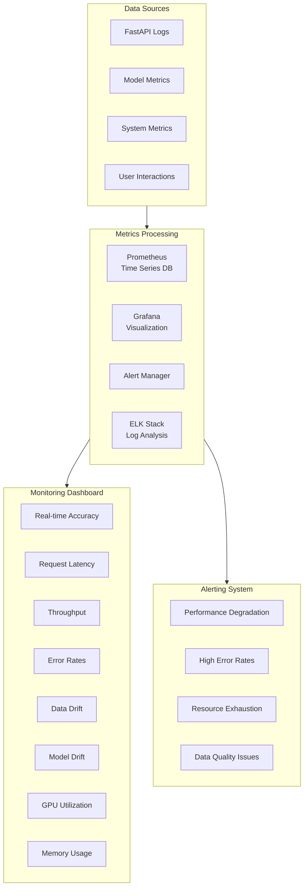

# Monitoring & Support Guide: Fake News Detection Project

## Overview
This guide outlines the monitoring and support framework for the 2-week Fake News Detection capstone project, ensuring smooth execution and timely issue resolution.

## Daily Monitoring Rhythm

### Morning Standups (9:00 AM EAT)
- **Duration**: 15 minutes
- **Format**: Video call via Slack/Teams
- **Agenda**:
  - What was accomplished yesterday?
  - What is planned for today?
  - Any blockers or issues?
- **Participants**: All team members + instructor
- **Recording**: Keep brief notes in shared document

### Progress Tracking
- **Tools**: GitHub Projects, shared spreadsheets
- **Metrics**:
  - Task completion status
  - Code commits and PRs
  - Test results and performance metrics
  - Blocker identification and resolution time

## Weekly Check-ins

### Friday Reviews (4:00 PM EAT)
- **Duration**: 1 hour
- **Format**: Full team presentation + Q&A
- **Agenda**:
  - Week summary and accomplishments
  - Current challenges and solutions
  - Next week planning
  - Risk assessment and mitigation
- **Deliverables**: Progress report and updated timeline

### Phase Transition Reviews
- **End of Phase 1** (Nov 15): Setup completion assessment
- **End of Phase 2** (Nov 18): Data pipeline validation
- **End of Phase 3** (Nov 22): Model performance review
- **End of Phase 4** (Nov 25): Deployment readiness check

## Technical Monitoring

### AWS CloudWatch Integration

### Environment Health Checks
- **Daily**: Run `verify_setup.py` on EC2
- **Automated**: Set up basic monitoring scripts
- **Manual**: Regular spot checks of system resources

### Code Quality Monitoring
- **PR Reviews**: Mandatory for all code changes
- **Testing**: Automated tests for ETL and models
- **Documentation**: Code comments and README updates
- **Performance**: Track model accuracy and training times

### AWS Resource Usage Monitoring
- **EC2 Metrics**: CPU, memory, disk, network utilization via CloudWatch
- **S3 Analytics**: Storage costs, data transfer, and access patterns
- **API Limits**: Monitor external service usage (Kaggle, Twitter, NewsAPI)
- **Cost Tracking**: Daily budget monitoring with alerts at 80% threshold
- **GPU Monitoring**: Real-time GPU utilization and memory usage (on GPU instances)

## Support Framework

### Tiered Support System

#### Tier 1: Self-Service
- **Resources**: Comprehensive documentation
- **Tools**: FAQ, troubleshooting guides
- **First Line**: Check provided guides and runbooks

#### Tier 2: Team Support
- **Peer Help**: Cross-team knowledge sharing
- **Documentation**: Update guides with solutions
- **Collaboration**: Pair programming sessions

#### Tier 3: Instructor Support
- **Office Hours**: Scheduled technical assistance
- **Emergency**: Same-day response for critical issues
- **Escalation**: Direct intervention for blockers

### Office Hours Schedule
- **Monday-Friday**: 2:00-4:00 PM EAT
- **Location**: Slack/Teams or EC2 instance
- **Booking**: Post in #tech-support channel
- **Format**: Screen sharing for debugging

## Issue Management

### Issue Classification
- **Critical**: Blocks project progress (response: <2 hours)
- **High**: Impacts multiple team members (response: <4 hours)
- **Medium**: Affects individual workflow (response: <24 hours)
- **Low**: Minor inconvenience (response: <48 hours)

### Issue Resolution Process
1. **Identification**: Team member reports issue
2. **Assessment**: Instructor evaluates impact and priority
3. **Assignment**: Assign to appropriate team/resource
4. **Resolution**: Implement fix with documentation
5. **Follow-up**: Verify resolution and prevent recurrence

### Common Issues and Solutions

#### Environment Setup Issues
- **RAPIDS Installation**: Check CUDA compatibility, use CPU version
- **Conda Conflicts**: Clean environment and reinstall
- **AWS Access**: Verify credentials and permissions

#### ETL Pipeline Issues
- **API Rate Limits**: Implement delays and caching
- **Data Quality**: Add validation and cleaning steps
- **Performance**: Optimize for large datasets

#### Model Training Issues
- **Memory Errors**: Reduce batch size, use GPU
- **Convergence Problems**: Adjust hyperparameters
- **Performance Gaps**: Compare sklearn vs cuML implementations

#### Deployment Issues
- **API Errors**: Test endpoints thoroughly
- **Scalability**: Monitor resource usage
- **Security**: Implement proper authentication

## Communication Protocols

### Emergency Communication
- **Channel**: Direct message to instructor
- **Response Time**: Within 30 minutes during business hours
- **Escalation**: Use for system outages or critical blockers

### Regular Updates
- **Daily**: Standup summaries in Slack
- **Weekly**: Progress reports via email
- **Milestone**: Achievement celebrations

### Documentation Updates
- **Issue Resolution**: Update guides with solutions
- **Best Practices**: Share successful approaches
- **Lessons Learned**: Document at project end

## Risk Monitoring

### Technical Risks
- **Resource Constraints**: Monitor EC2 usage and costs
- **Dependency Failures**: Track external API availability
- **Performance Issues**: Regular benchmarking

### Team Risks
- **Communication Breakdowns**: Monitor participation in standups
- **Workload Imbalance**: Track individual contributions
- **Motivation Issues**: Regular check-ins on team morale

### Project Risks
- **Timeline Slippage**: Weekly milestone reviews
- **Scope Creep**: Strict requirements management
- **Quality Compromises**: Mandatory testing and reviews

## Escalation Matrix

### Level 1: Team Level
- **Handled By**: Team members and PMs
- **Timeframe**: Immediate resolution
- **Escalation Trigger**: Unable to resolve within 2 hours

### Level 2: Instructor Level
- **Handled By**: Instructor with team input
- **Timeframe**: Same-day resolution
- **Escalation Trigger**: Impacts project timeline

### Level 3: Stakeholder Level
- **Handled By**: Instructor with program leadership
- **Timeframe**: Within 24 hours
- **Escalation Trigger**: Threatens project success

## Success Metrics

### Monitoring Effectiveness
- **Response Times**: Average time to resolve issues
- **Prevention Rate**: Issues caught before escalation
- **Resolution Quality**: Percentage of permanent fixes

### Support Quality
- **Satisfaction**: Team feedback on support experience
- **Self-Sufficiency**: Reduction in support requests over time
- **Knowledge Sharing**: Documentation completeness

### Project Health
- **Milestone Achievement**: On-time delivery rate
- **Quality Metrics**: Test pass rates, code review feedback
- **Team Morale**: Regular sentiment checks

## Tools and Resources

### Monitoring Tools
- **AWS CloudWatch**: Resource monitoring
- **GitHub Insights**: Code and collaboration metrics
- **Slack Analytics**: Communication patterns
- **Custom Scripts**: Automated health checks

### Support Resources
- **Documentation Hub**: Centralized knowledge base
- **Code Templates**: Reusable solutions
- **Mentor Network**: External technical advisors
- **Backup Systems**: Alternative development environments

## Continuous Improvement

### Feedback Collection
- **Daily**: Quick pulse surveys
- **Weekly**: Structured feedback sessions
- **End of Project**: Comprehensive retrospective

### Process Updates
- **Documentation**: Regular guide updates
- **Tools**: Evaluation of monitoring effectiveness
- **Training**: Support team skill development

### Lessons Learned
- **Issue Patterns**: Common problems and solutions
- **Process Improvements**: Workflow optimizations
- **Resource Planning**: Better support allocation

## Emergency Procedures

### System Outage
1. **Assessment**: Determine scope and impact
2. **Communication**: Notify all affected parties
3. **Workaround**: Implement backup solutions
4. **Resolution**: Restore systems and document cause

### Critical Blocker
1. **Immediate Response**: Instructor intervention
2. **Team Mobilization**: All hands on deck
3. **Alternative Solutions**: Quick workarounds
4. **Root Cause Analysis**: Post-resolution investigation

### Team Crisis
1. **Private Discussion**: Individual conversations
2. **Mediation**: Facilitated conflict resolution
3. **Rebalancing**: Role or team adjustments
4. **Support Resources**: Additional mentoring

This monitoring and support framework ensures the project stays on track with proactive issue prevention, rapid resolution, and continuous improvement throughout the 2-week development cycle.