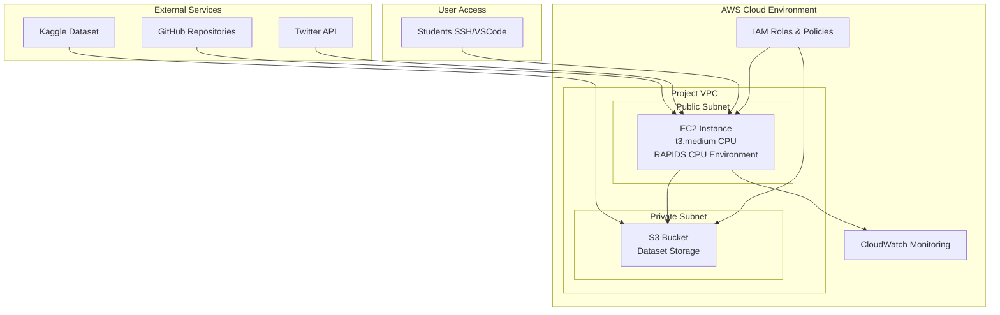

# Project Kickoff Guide: Fake News Detection

## Kickoff Meeting Agenda (November 13, 2 hours)

### 1. Welcome & Introductions (15 minutes)
- **Instructor Welcome**: Project overview and congratulations
- **Team Introductions**: Each member shares background and expectations
- **Icebreaker**: "What's one fake news story you've encountered?"

### 2. Project Overview (20 minutes)
- **Challenge Statement**: Build ML classifiers for fake news detection
- **Technical Requirements**: sklearn vs RAPIDS cuML comparison
- **Success Criteria**: Accuracy >85%, GPU speedup, deployable API
- **Timeline Review**: 2-week sprint from Nov 13-28

### 3. Team Formation & Roles (15 minutes)
- **Group Assignments**:
  - Group A: John (PM), Elsa (Data Analyst), Bismarck (ML Engineer), Teddy (QA)
  - Group B: Kigen (PM), Lamech (Data Analyst), Nehemiah (ML Engineer), Wilberforce (QA)
- **Role Responsibilities**: Detailed breakdown for each role
- **Collaboration Expectations**: Communication and teamwork guidelines

### 4. Infrastructure & Access Setup (30 minutes)
- **AWS Resources**: EC2 instance, S3 bucket, IAM users
- **Access Credentials**: Distribution of keys and credentials
- **EC2 Connection**: SSH access demonstration
- **Repository Setup**: Git workflow and branching strategy

#### AWS Infrastructure Details
- **EC2 Instance**: `i-0a444afe43fd747c7` (54.197.52.129) - t3.medium CPU instance with RAPIDS CPU acceleration
- **S3 Bucket**: `fake-news-project-data-2025` - Centralized data storage
- **IAM Users**: 8 individual accounts (Group A: bismark, elsa, teddy, john; Group B: wilberforce, nehemiah, kigen, lamech)
- **Security**: VPC isolation, security groups, MFA requirements
- **GPU Upgrade**: Available via AWS limit increase request (24-48 hours approval)

#### Infrastructure Architecture

### 5. Technical Environment (20 minutes)
- **RAPIDS Overview**: GPU acceleration benefits
- **Environment Setup**: Local and EC2 configuration
- **Tools & Libraries**: Required packages and versions
- **Testing Setup**: Verification scripts and procedures

### 6. Phase 1 Planning (30 minutes)
- **Week 1 Goals**: Setup completion by November 15
- **Daily Standups**: 9 AM EAT schedule
- **Initial Tasks**: Environment setup, ETL pipeline testing
- **Risk Assessment**: Potential blockers and mitigation

### 7. Q&A and Next Steps (15 minutes)
- **Open Discussion**: Address immediate questions
- **Action Items**: Specific tasks for each team member
- **Support Resources**: Office hours and help channels
- **Next Meeting**: Friday check-in schedule

## Pre-Kickoff Preparation

### Instructor Preparation
- [ ] Verify all AWS resources are created and accessible
- [ ] Prepare credential packages for each student
- [ ] Test EC2 instance connectivity
- [ ] Review all documentation for accuracy
- [ ] Prepare presentation materials

### Student Preparation
- [ ] Enable MFA on Gmail accounts
- [ ] Install AWS CLI on local machines
- [ ] Review prerequisite knowledge (pandas, sklearn)
- [ ] Prepare questions for kickoff meeting

## Post-Kickoff Activities

### Immediate Actions (November 13)
- [ ] Distribute credentials via secure channels
- [ ] Send welcome email with access information
- [ ] Create team communication channels
- [ ] Share onboarding guide and checklists

### Day 1 Follow-up (November 14)
- [ ] Monitor setup progress via Slack/Teams
- [ ] Provide technical support for installation issues
- [ ] Verify EC2 access for all team members
- [ ] Address any immediate blockers

### Week 1 Monitoring (November 13-15)
- [ ] Daily check-ins on setup progress
- [ ] Office hours for technical assistance
- [ ] Coordinate between groups for shared learnings
- [ ] Prepare for Phase 2 transition

## Communication Plan

### During Kickoff
- **Screen Sharing**: Demonstrate EC2 access and basic commands
- **Live Coding**: Show ETL pipeline execution
- **Interactive Discussion**: Encourage questions throughout
- **Breakout Rooms**: Small group discussions for team bonding

### Post-Kickoff
- **Slack Channels**: #general, #groupA, #groupB, #tech-support
- **Daily Updates**: Progress reports in dedicated channel
- **Documentation**: Central repository for all guides and resources
- **Emergency Contact**: Direct line for critical issues

## Risk Mitigation

### Technical Risks
- **Environment Setup Issues**: Provide detailed guides and office hours
- **Access Problems**: Have backup credential distribution methods
- **Hardware Limitations**: Monitor EC2 performance and plan upgrades

### Team Dynamics Risks
- **Communication Barriers**: Establish clear communication protocols
- **Workload Imbalance**: Regular check-ins and role adjustments
- **Technical Skill Gaps**: Pair programming and knowledge sharing

### Project Risks
- **Timeline Slippage**: Strict milestone adherence with buffers
- **Scope Creep**: Clear requirements and change control process
- **Quality Issues**: Mandatory code reviews and testing

## Success Metrics for Kickoff

### Immediate Outcomes
- [ ] All students have working AWS credentials
- [ ] SSH access to EC2 confirmed for all team members
- [ ] Team communication channels established
- [ ] Clear understanding of roles and responsibilities

### Short-term Outcomes (Week 1)
- [ ] 100% environment setup completion by November 15
- [ ] Functional ETL pipeline execution
- [ ] Established daily standup routine
- [ ] Positive team morale and collaboration

### Long-term Impact
- [ ] Successful project completion by November 28
- [ ] High-quality deliverables meeting all requirements
- [ ] Valuable learning experience for all participants
- [ ] Strong foundation for future data science careers

## Contingency Plans

### If Technical Issues Arise
- **Backup Environment**: Google Colab for initial development
- **Local Development**: Full project runnable on local machines
- **Simplified Setup**: CPU-only version if GPU setup fails

### If Team Issues Occur
- **Role Reassignment**: Flexible role adjustments based on strengths
- **Additional Support**: Extra mentoring for struggling team members
- **Group Restructuring**: Rebalance teams if necessary

### If Timeline Slips
- **Scope Adjustment**: Prioritize core requirements
- **Resource Addition**: Extra instructor support hours
- **Extension Options**: Negotiate deadline adjustments if needed

## Resources Checklist

### Technical Resources
- [ ] EC2 instance running and accessible
- [ ] S3 bucket created and permissions set
- [ ] IAM users created with appropriate policies
- [ ] GitHub repository accessible
- [ ] All documentation files prepared

### Communication Resources
- [ ] Slack/Teams workspace created
- [ ] Email distribution lists ready
- [ ] Meeting rooms booked for check-ins
- [ ] Office hours schedule published

### Support Resources
- [ ] Instructor availability confirmed
- [ ] Technical mentors identified
- [ ] Backup communication channels
- [ ] Emergency contact procedures

## Final Checklist

### Pre-Kickoff
- [ ] All AWS resources verified
- [ ] Credentials prepared for distribution
- [ ] Documentation finalized
- [ ] Meeting logistics confirmed
- [ ] Backup plans ready

### During Kickoff
- [ ] Agenda followed with time management
- [ ] All technical demos successful
- [ ] Questions adequately addressed
- [ ] Team energy positive and engaged

### Post-Kickoff
- [ ] Follow-up communications sent
- [ ] Support channels monitored
- [ ] Progress tracking initiated
- [ ] Issues addressed promptly

This kickoff guide ensures a smooth project start with clear expectations, proper resource allocation, and strong foundations for success.