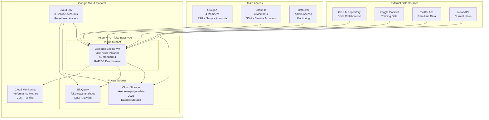

# Project Kickoff Guide: Fake News Detection Capstone (GCP Version)

## 🎯 Project Overview

Welcome to the **Fake News Detection Capstone Project**! This 2-week intensive program will challenge you to build a complete machine learning pipeline on Google Cloud Platform, from data ingestion to model deployment.

### 🎯 Project Goal
Build an end-to-end fake news detection system using RAPIDS GPU acceleration that can:
- Process news articles from multiple sources
- Classify content as fake or real with >85% accuracy
- Deploy as a scalable REST API
- Demonstrate 2x+ speedup with GPU acceleration

### 🏆 Success Criteria
- **Technical**: RAPIDS cuML implementation with performance benchmarks
- **Quality**: Model accuracy >85%, F1-score >0.85
- **Scalability**: Handle 1000+ requests/minute
- **Delivery**: Complete working system by November 28

---

## 👥 Team Structure

### Group A
| Role | Name | Email | GCP Service Account |
|------|------|-------|-------------------|
| Project Manager | John | jnyangara303@gmail.com | john-student@fake-news-project.iam.gserviceaccount.com |
| Data Analyst | Elsa | elsernownex@gmail.com | elsa-student@fake-news-project.iam.gserviceaccount.com |
| ML Engineer | Bismarck | bismarkkoima844@gmail.com | bismark-student@fake-news-project.iam.gserviceaccount.com |
| QA | Teddy | amdanyteddy@gmail.com | teddy-student@fake-news-project.iam.gserviceaccount.com |

### Group B
| Role | Name | Email | GCP Service Account |
|------|------|-------|-------------------|
| Project Manager | Kigen | kigenyego@gmail.com | kigen-student@fake-news-project.iam.gserviceaccount.com |
| Data Analyst | Lamech | lamechrop45@gmail.com | lamech-student@fake-news-project.iam.gserviceaccount.com |
| ML Engineer | Nehemiah | nehemiahkipchumba89@gmail.com | nehemiah-student@fake-news-project.iam.gserviceaccount.com |
| QA | Wilberforce | wilberforcekimutai68@gmail.com | wilberforce-student@fake-news-project.iam.gserviceaccount.com |

---

## 🏗️ GCP Infrastructure Overview

### Core Resources
- **Project ID**: `fake-news-project`
- **Region**: `us-central1` (Iowa, USA)
- **Compute Engine VM**: `fake-news-instance` (n1-standard-4, 15GB RAM)
- **Cloud Storage**: `gs://fake-news-project-data-2025/`
- **BigQuery**: Analytics and data exploration
- **Cloud Monitoring**: Performance tracking and alerting

### Infrastructure Architecture


### Security & Access Control
- **Cloud IAM**: Service accounts with least-privilege access
- **VPC Firewall**: Controlled network access
- **Cloud Audit Logs**: Complete activity logging
- **Service Account Keys**: Individual JSON keys for authentication

---

## 📅 Project Timeline & Milestones

### Phase 1: Planning & Setup (Nov 13-15)
**Goal**: Complete environment setup and project planning

#### Day 1: Environment Setup (Nov 13)
- [ ] Receive GCP service account credentials
- [ ] Install Google Cloud SDK locally
- [ ] Configure authentication and project access
- [ ] Test VM SSH access and Cloud Storage permissions
- [ ] Install and verify RAPIDS environment

#### Day 2: Team Formation & Planning (Nov 14)
- [ ] Attend project kickoff meeting
- [ ] Review team roles and responsibilities
- [ ] Set up communication channels (Slack/Teams)
- [ ] Initialize Git repository and branching strategy
- [ ] Review project documentation and requirements

#### Day 3: Initial Development (Nov 15)
- [ ] Run ETL pipeline with sample data
- [ ] Set up Jupyter Lab environment
- [ ] Create initial project structure
- [ ] Document setup process and any issues

**Deliverables**: Environment verification complete, team communication established

### Phase 2: Data Acquisition & Processing (Nov 16-18)
**Goal**: Collect, clean, and preprocess training data

#### Data Sources
- **Kaggle Fake News Dataset**: Baseline training data (labeled)
- **Twitter API**: Real-time social media content
- **NewsAPI**: Current news articles from major sources
- **Web Scraping**: Additional news sources (if needed)

#### Key Activities
- [ ] Configure API credentials (Kaggle, Twitter, NewsAPI)
- [ ] Execute ETL pipeline (`etl_pipeline_gcp.py`)
- [ ] Perform exploratory data analysis
- [ ] Implement text preprocessing (stemming, TF-IDF)
- [ ] Validate data quality and balance

**Deliverables**: Processed dataset ready for model training

### Phase 3: Model Development & Training (Nov 19-22)
**Goal**: Build and optimize ML models with GPU acceleration

#### Technical Requirements
- **Algorithms**: SVM, Random Forest, Logistic Regression
- **Frameworks**: sklearn (CPU) vs cuML (GPU)
- **Performance**: Compare training times and accuracy
- **Optimization**: Hyperparameter tuning and feature engineering

#### Development Workflow
- [ ] Implement baseline sklearn models
- [ ] Port to cuML for GPU acceleration
- [ ] Performance benchmarking and comparison
- [ ] Model validation and cross-validation
- [ ] Document results and insights

**Deliverables**: Trained models with performance benchmarks

### Phase 4: API Development & Deployment (Nov 23-25)
**Goal**: Build and deploy scalable prediction API

#### Technical Implementation
- **Framework**: FastAPI for REST API development
- **Deployment**: Cloud Run for serverless deployment
- **Monitoring**: Cloud Monitoring integration
- **Security**: Authentication and rate limiting

#### Testing & Validation
- [ ] Unit tests for API endpoints
- [ ] Load testing with Locust
- [ ] Integration testing with real data
- [ ] Performance optimization and scaling

**Deliverables**: Production-ready API with monitoring

### Phase 5: Final Presentation & Documentation (Nov 26-28)
**Goal**: Demonstrate complete working system

#### Presentation Requirements
- **Technical Demo**: Live API demonstration
- **Performance Metrics**: Accuracy, speed, scalability results
- **GPU Benefits**: sklearn vs cuML comparison
- **Lessons Learned**: Challenges and solutions

#### Final Deliverables
- [ ] Complete working system
- [ ] Technical documentation
- [ ] Performance benchmarks
- [ ] Project retrospective

**Final Deadline**: November 28, 2025

---

## 🛠️ Technical Stack & Tools

### Core Technologies
- **RAPIDS**: GPU-accelerated data science (cuDF, cuML, cuGraph)
- **Google Cloud**: Compute Engine, Cloud Storage, BigQuery
- **Python**: 3.9+ with scientific computing stack
- **FastAPI**: Modern REST API framework
- **MLflow**: Experiment tracking and model management

### Development Environment
- **Compute Engine VM**: Pre-configured with RAPIDS
- **Jupyter Lab**: Interactive development and experimentation
- **Git**: Version control with GitHub integration
- **Cloud Shell**: Alternative development environment

### Monitoring & Quality Assurance
- **Cloud Monitoring**: Performance metrics and alerting
- **pytest**: Automated testing framework
- **pre-commit**: Code quality checks
- **GitHub Actions**: CI/CD pipeline

---

## 📊 Success Metrics & Evaluation

### Technical Excellence (40%)
- **Model Performance**: Accuracy >85%, F1-score >0.85
- **GPU Acceleration**: Demonstrated 2x+ speedup with cuML
- **Code Quality**: Well-documented, tested, and maintainable
- **Innovation**: Creative solutions to technical challenges

### Project Management (30%)
- **Timeline Adherence**: All milestones met on schedule
- **Team Collaboration**: Effective communication and task distribution
- **Risk Management**: Proactive identification and mitigation
- **Documentation**: Comprehensive project artifacts

### Business Impact (20%)
- **Problem Solving**: Clear fake news detection capability
- **Scalability**: Handle varying load patterns
- **Deployment**: Production-ready API with monitoring
- **User Experience**: Intuitive system interface

### Presentation & Communication (10%)
- **Technical Delivery**: Clear explanation of complex concepts
- **Demo Quality**: Working system demonstration
- **Visual Design**: Professional presentation materials
- **Q&A Handling**: Confident responses to technical questions

---

## 💰 Cost Management & Budgeting

### Estimated Costs (2-week project)
- **Compute Engine** (n1-standard-4): ~$120 (24/7 usage)
- **GPU Upgrade** (a2-highgpu-1g): ~$250 (if approved)
- **Cloud Storage**: ~$5 (data storage)
- **Cloud Monitoring**: ~$10 (metrics and logging)
- **Total Estimated**: $135-265

### Cost Optimization Strategies
- **Scheduled Shutdown**: Stop VM when not actively developing
- **Preemptible Instances**: 80% discount for interruptible workloads
- **Resource Monitoring**: Set up alerts at 80% of budget
- **Storage Classes**: Use appropriate storage tiers

### Budget Monitoring
```bash
# Check current costs
gcloud billing accounts list
gcloud billing budgets list

# Set up alerts
gcloud billing budgets create fake-news-budget \
    --billing-account=YOUR_BILLING_ACCOUNT \
    --display-name="Fake News Project Budget" \
    --amount=300.00 \
    --currency=USD
```

---

## 🚨 Risk Management

### Technical Risks
- **GPU Access**: May need limit increase approval
- **API Limits**: External service rate limits
- **Data Quality**: Ensuring balanced and clean datasets
- **Performance**: Meeting accuracy and speed requirements

### Mitigation Strategies
- **GPU Fallback**: CPU RAPIDS implementation available
- **Data Backup**: Multiple data sources and caching
- **Testing**: Comprehensive validation at each phase
- **Documentation**: Detailed troubleshooting guides

### Communication Plan
- **Daily Standups**: 9 AM EAT via video call
- **Progress Updates**: Friday review meetings
- **Issue Escalation**: Instructor office hours (2-4 PM EAT)
- **Emergency**: Direct messaging for critical blockers

---

## 📚 Resources & Support

### Documentation
- **Project Wiki**: Comprehensive guides and FAQs
- **GCP Documentation**: Cloud service references
- **RAPIDS Docs**: GPU acceleration guides
- **API References**: External service documentation

### Support Channels
- **Instructor Office Hours**: Mon-Fri, 2-4 PM EAT
- **Team Collaboration**: Slack/Teams channels
- **Code Reviews**: GitHub pull request process
- **Technical Help**: GCP support and community forums

### Key Contacts
- **Project Instructor**: DataMan
- **Technical Support**: GCP Console support
- **Team Coordination**: Project Managers (John & Kigen)

---

## 🎯 Getting Started Checklist

### Immediate Actions (Today)
- [ ] Review this kickoff guide thoroughly
- [ ] Set up Google Cloud SDK on your local machine
- [ ] Configure GCP authentication with your service account key
- [ ] Test access to Compute Engine VM and Cloud Storage
- [ ] Join team communication channels

### Week 1 Preparation
- [ ] Complete environment verification (`verify_setup_gcp.py`)
- [ ] Run initial ETL pipeline test
- [ ] Set up local development environment (optional)
- [ ] Review team roles and responsibilities
- [ ] Plan Phase 2 data collection strategy

### Success Factors
- **Early Setup**: Complete environment configuration by Nov 15
- **Regular Communication**: Attend all standups and meetings
- **Documentation**: Keep detailed notes and code comments
- **Quality Focus**: Test frequently and document issues
- **Team Collaboration**: Support fellow team members

---

## 🏁 Final Notes

This capstone project represents the culmination of your data science education, combining:
- **Technical Excellence**: RAPIDS GPU acceleration and ML engineering
- **Cloud Architecture**: Google Cloud Platform best practices
- **Team Dynamics**: Professional collaboration and project management
- **Real-World Impact**: Solving the critical problem of fake news detection

**Remember**: This is a learning experience. Focus on understanding the concepts, documenting your process, and demonstrating the power of GPU-accelerated machine learning on Google Cloud Platform.

Let's build an impressive fake news detection system that showcases the potential of RAPIDS and GCP! 🚀

**Project Start**: November 13, 2025
**Final Deadline**: November 28, 2025

Good luck, and let's make this project a success! 🎯